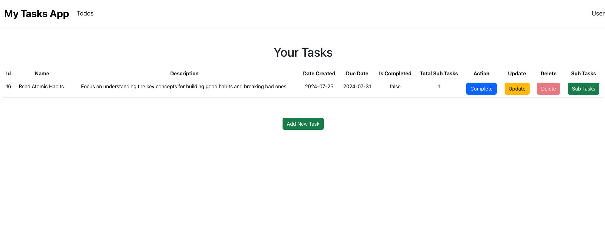
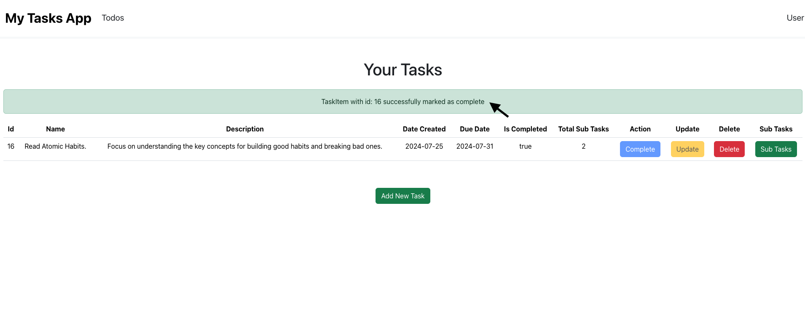

# task-manager-backend
Task list application

The Task list application is a RESTful service for managing tasks and their associated sub-tasks. It allows users to perform CRUD (Create, Read, Update, Delete) operations on tasks and sub-tasks. Tasks can only be marked as complete when all associated sub-tasks are completed or tasks have no sub-tasks. The API is built using .NET with Entity Framework Core and uses SQLite as the database.

Features
CRUD Operations: Create, Read, Update, and Delete tasks and sub-tasks.
Task Completion: Ensure a task can only be completed if all sub-tasks are marked complete.
Sub-Task Count: Provides a count of sub-tasks when retrieving tasks.
Unit Testing: Validates functionality using Moq for mocking dependencies.
SQLite Database: Uses SQLite for persistent storage.

Technologies
.NET 6
Entity Framework Core
SQLite
ASP.NET Core Web API
Moq (for unit testing)

Endpoints.

GET /api/tasks/

This endpoint gets all the tasks from the backend. On the frontend it shows like this:

GET /api/tasks/{id}

This endpoint gets all the taskitem by its id from the backend. On the frontend it shows like this: 

POST /api/tasks

This endpooints adds a new task to the app. On the frontend it shows like this: 
 
 

PUT /api/tasks/{id}

This endpoint updates the task. On the frontend it shows like this: 

The taskItem is retreived by its id and a form opens up which autofills the task item to be updated enabling user to change accordingly.
 

The image beow the updated task item.

DELETE /api/tasks/{id}

This endpoint deletes the task. On the frontend it shows like this: 

The Delete Task item for the task is disabled initially, as TaskItem can only be deleted once it is marked as complete. 
A Taskitem can be marked as completed in 2 conditions:
    1. If it has 0 SubTasks.
    2. All Subtasks of a TaskItem are marked as complete.

TaskItem 15 is marked as complete because it has 0 Subtasks. Hence the Delte button is Enabled for TaskItem 15.

TaskItem 16 cannot be marked as complete because it has one not completed subtask. Hence the delete button is disabled.

Since TaskItem15 was marked as completed it is now sucessfully deleted. TaskItem 16 is only left in the database.

The SubTasks with id 9 & 10 are marked as completed with the click the complete button. The complete button is now disabled.

Since the subtasks for TaskItem16 are marked as completed, TaskItem16 can now be marked as completed.

The complete button for TaskItem 16 is disabled.

TaskItem16 is noe deleted sucessfully.

